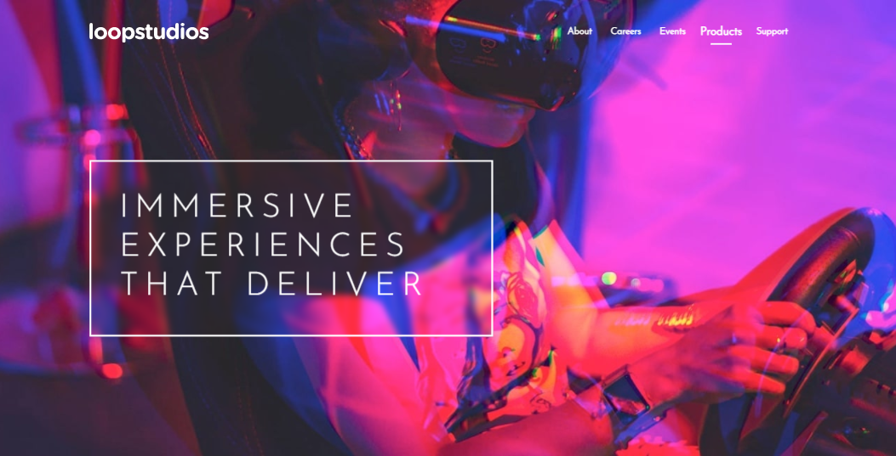
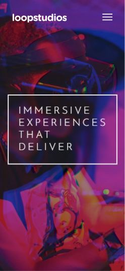

# Frontend Mentor - Loopstudios landing page solution

## Table of contents

- [Overview](#overview)
  - [The challenge](#the-challenge)
  - [Screenshot](#screenshot)
  - [Links](#links)
- [My process](#my-process)
  - [Built with](#built-with)
  - [What I learned](#what-i-learned)
- [Author](#author)

## Overview

### The challenge

Users should be able to:
- View the optimal layout for the site depending on their device's screen size
- See hover states for all interactive elements on the page

### Screenshot

### Links

<!-- - Solution URL: [Sunnyside-Agency-Landing-Page](https://sunnside-agency.netlify.app/) -->

## My process

### Built with

- Semantic HTML5 markup
- Grid Template Area, columns and rows used to layout the whole page on desktop and mobile screens.
- Styled using SCSS variables, nested styles and variables.
- Parallax scrolling on the header element which also contains the navigation elements.
- Flexbox used to layout the footer logo, icons and links.
- CSS3 box shadows around the gallery button.
- Creations gallery popoulated via Javascript Template Literal objects.
- Responsive design.

### What I learned

I got good practice on CSS Grid template columns, grid template rows and grid template areas.

### Continued development

I would like to improve my css positioning. I'm also keen on learning about when best to use javascript and when is css alone adequate for a particular problem.

## Author

- Website - [Boitumelo Sempe](http://shakexsempe.netlify.app/)
- Frontend Mentor - [@ShakexSempe](https://www.frontendmentor.io/profile/ShakexSempe)
